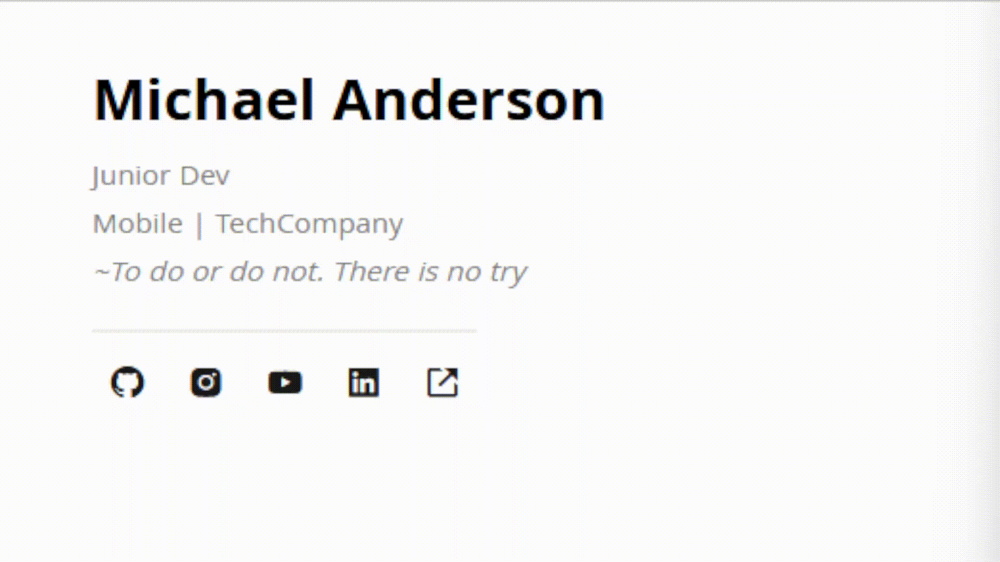

# Assinaturas de e-mail

Modelos de assinaturas para e-mail em html

> 💡Altere os ícones através da biblioteca [Boxicons](https://boxicons.com/)  
> Saiba como inseri-los 👉 [Boxicons](https://boxicons.com/usage#import-css)
## Modelos

### Modelo 1

## Ícones
Os ícones utilizados fazem parte da biblioteca do [Boxicons](https://boxicons.com/)